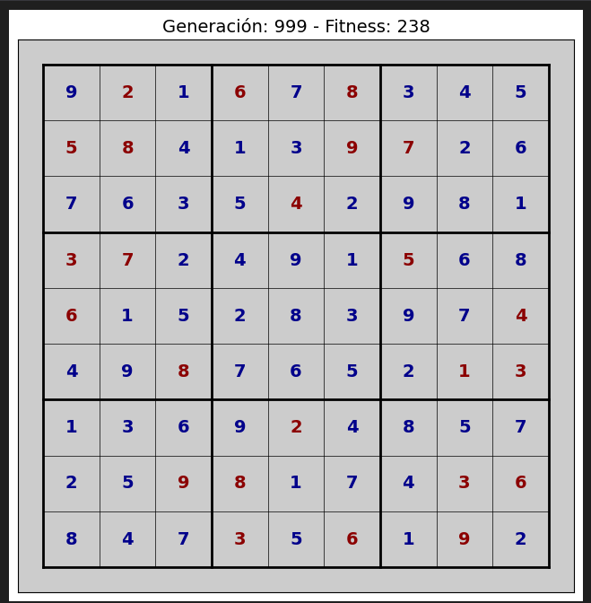

# 📐 Optimization & Simulation Playground

A comprehensive repository dedicated to modeling, solving, and analyzing **Exact Mathematical Optimization** problems and **Metaheuristic / Evolutionary Algorithms**. The project bridges deterministic operations research (Linear Programming, Quadratic Programming, and Non-Convex Nonlinear Programming via **Gurobi Optimizer**) and stochastic artificial intelligence (**Genetic Algorithms**) for solving complex combinatorial constraint satisfaction problems (9x9 Sudoku).

---

## 🧭 Repository Structure

The repository is structured into two primary modules based on the optimization paradigm:

```text
Optimization-simulation/
├── Gurobi-playground/             # Mathematical Programming with Gurobi Optimizer
│   ├── 1. Modelo simple.ipynb     # Introduction to Gurobi, linear and quadratic models
│   ├── 2. Quicksum.ipynb          # Multi-index modeling, quicksum, and machine scheduling
│   ├── 3. Sensibilidad.ipynb      # Sensitivity analysis (reduced costs, shadow prices, slacks)
│   ├── 3.1 jardin.ipynb           # Garden area maximization (bilinear objective)
│   ├── 3.2 caja.ipynb             # Box volume maximization from sheet metal / cardboard
│   ├── 3.3 Tiempo de viajke.ipynb # The Island Challenge: travel time minimization (GenConstrPow)
│   ├── 3.4 Ingresos.ipynb         # Car rental revenue maximization with linear price-demand
│   ├── 3.5 Rectangulo.ipynb       # Maximum-area rectangle inscribed in an ellipse
│   ├── 3.6 Superficie.ipynb       # Surface area minimization of an open box with fixed volume
│   ├── 3.7 Barra.ipynb            # Rigid bar through a narrowing corner hallway (NonConvex)
│   └── README.md                  # Module-specific documentation for Gurobi
│
├── Sudoku-Genetic-Algorithm/      # Metaheuristics & Evolutionary Algorithms
│   ├── Sudoku-GA.ipynb            # 9x9 Sudoku Solver using Genetic Algorithms
│   └── docs/                      # Visual documentation and diagrams
│       └── image.png
│
├── .gitignore                     # Git ignore rules (checkpoints, virtual environments, caches)
└── README.md                      # Global project documentation
```

---

## 📂 Detailed Folder Contents

### 1. [`Gurobi-playground/`](file:///home/rc/workspace/Optimization-simulation/Gurobi-playground)

This module demonstrates exact mathematical programming using the Gurobi Python API ([`gurobipy`](file:///home/rc/workspace/Optimization-simulation/Gurobi-playground/1.%20Modelo%20simple.ipynb#L20)). It ranges from introductory LP/QP formulations to advanced post-optimal sensitivity analysis and non-convex quadratic/nonlinear optimization using Gurobi's `NonConvex=2` engine.

| Notebook | Problem Type | Mathematical Modeling & Key Concepts |
| :--- | :--- | :--- |
| [1. Modelo simple.ipynb](file:///home/rc/workspace/Optimization-simulation/Gurobi-playground/1.%20Modelo%20simple.ipynb) | Basic LP / QP | Core workflow in Gurobi: initializing [`Model`](file:///home/rc/workspace/Optimization-simulation/Gurobi-playground/1.%20Modelo%20simple.ipynb#L78), declaring continuous decision variables with [`addVar`](file:///home/rc/workspace/Optimization-simulation/Gurobi-playground/1.%20Modelo%20simple.ipynb#L81), setting objective functions via [`setObjective`](file:///home/rc/workspace/Optimization-simulation/Gurobi-playground/1.%20Modelo%20simple.ipynb#L85), enforcing linear/quadratic constraints ([`addConstr`](file:///home/rc/workspace/Optimization-simulation/Gurobi-playground/1.%20Modelo%20simple.ipynb#L88)), solving with [`optimize()`](file:///home/rc/workspace/Optimization-simulation/Gurobi-playground/1.%20Modelo%20simple.ipynb#L92), and exporting to `.lp` files. Includes a classic paint manufacturing blend problem (exterior vs. interior paint). |
| [2. Quicksum.ipynb](file:///home/rc/workspace/Optimization-simulation/Gurobi-playground/2.%20Quicksum.ipynb) | Assignment / LP | Efficient multi-dimensional formulation: tuple-indexed variables using [`model.addVars(arcos, ...)`](file:///home/rc/workspace/Optimization-simulation/Gurobi-playground/2.%20Quicksum.ipynb#L96) and scalable summations using [`gp.quicksum`](file:///home/rc/workspace/Optimization-simulation/Gurobi-playground/2.%20Quicksum.ipynb#L106). Solves a manufacturing assignment problem allocating parts to machines under operating hour constraints. |
| [3. Sensibilidad.ipynb](file:///home/rc/workspace/Optimization-simulation/Gurobi-playground/3.%20Sensibilidad.ipynb) | Post-Optimal Analysis | Comprehensive sensitivity and duality analysis for Linear Programming: reduced costs ([`var.RC`](file:///home/rc/workspace/Optimization-simulation/Gurobi-playground/3.%20Sensibilidad.ipynb#L380)), constraint slack/surplus values ([`constr.Slack`](file:///home/rc/workspace/Optimization-simulation/Gurobi-playground/3.%20Sensibilidad.ipynb#L402)), dual / shadow prices ([`constr.Pi`](file:///home/rc/workspace/Optimization-simulation/Gurobi-playground/3.%20Sensibilidad.ipynb#L424)), and allowable sensitivity ranges for objective coefficients (`SAObjLow`, `SAObjUp`) and right-hand side parameters (`SARHSLow`, `SARHSUp`). |
| [3.1 jardin.ipynb](file:///home/rc/workspace/Optimization-simulation/Gurobi-playground/3.1%20jardin.ipynb) | Bilinear NLP | Maximizing the rectangular area of a garden bordered on one side by an existing stone wall and bounded by a fixed length of fencing ($2x + y \le 100$). Handles the non-convex bilinear product $x \cdot y$ by setting `NonConvex = 2`. |
| [3.2 caja.ipynb](file:///home/rc/workspace/Optimization-simulation/Gurobi-playground/3.2%20caja.ipynb) | Non-Convex NLP | Maximizing the volume of an open-top box constructed from a 24 $\times$ 36 inch cardboard sheet by cutting identical square corners of size $h$. Features a trilinear objective $V = (36-2h)(24-2h)h$. |
| [3.3 Tiempo de viajke.ipynb](file:///home/rc/workspace/Optimization-simulation/Gurobi-playground/3.3%20Tiempo%20de%20viajke.ipynb) | Square-Root NLP | *The Island Challenge*: Minimizing the total travel time from a coastal cabin to an offshore island by running along the shoreline at 8 mph and swimming diagonally at 3 mph. Models Euclidean distance and square-root terms using general power constraints ([`model.addGenConstrPow`](file:///home/rc/workspace/Optimization-simulation/Gurobi-playground/3.3%20Tiempo%20de%20viajke.ipynb#L14)). |
| [3.4 Ingresos.ipynb](file:///home/rc/workspace/Optimization-simulation/Gurobi-playground/3.4%20Ingresos.ipynb) | Quadratic QP | Revenue maximization for a car rental agency subject to a linear price-demand relationship $n(p) = 1000 - 5p$ with daily rates $p \in [50, 200]$. Formulates the quadratic revenue function $R = n \cdot p$. |
| [3.5 Rectangulo.ipynb](file:///home/rc/workspace/Optimization-simulation/Gurobi-playground/3.5%20Rectangulo.ipynb) | Geometric NLP | Optimal sizing of a rectangle inscribed within an ellipse with equation $\frac{x^2}{4} + y^2 = 1$ to maximize total area $A = 4xy$. |
| [3.6 Superficie.ipynb](file:///home/rc/workspace/Optimization-simulation/Gurobi-playground/3.6%20Superficie.ipynb) | Quadratically Constrained (QCP) | Minimizing the total surface area of an open-top rectangular box with a square base and fixed volume of $216\text{ in}^3$. Employs an auxiliary quadratic variable $w = x^2$ to recast the volume constraint into Gurobi-compatible form $w \cdot z = 216$. |
| [3.7 Barra.ipynb](file:///home/rc/workspace/Optimization-simulation/Gurobi-playground/3.7%20Barra.ipynb) | Geometric NLP | Determining the maximum length of a rigid object that can be maneuvered horizontally around a right-angled hallway corner narrowing from 8 ft to 6 ft. Formulated using similar triangles ($xy = 48$) and minimizing the squared bottleneck distance $L^2 = (6+y)^2 + (8+x)^2$. |

---

### 2. [`Sudoku-Genetic-Algorithm/`](file:///home/rc/workspace/Optimization-simulation/Sudoku-Genetic-Algorithm)

<p align="center">
  
</p>

This module implements a complete evolutionary framework based on **Genetic Algorithms (GA)** to solve the NP-complete constraint satisfaction problem of **9 $\times$ 9 Sudoku**.

* **Main Notebook:** [`Sudoku-GA.ipynb`](file:///home/rc/workspace/Optimization-simulation/Sudoku-Genetic-Algorithm/Sudoku-GA.ipynb)
* **Core Class:** [`SudokuGeneticAlgorithm`](file:///home/rc/workspace/Optimization-simulation/Sudoku-Genetic-Algorithm/Sudoku-GA.ipynb#L63)
* **Resource Assets:** [`docs/`](file:///home/rc/workspace/Optimization-simulation/Sudoku-Genetic-Algorithm/docs) containing visual architecture and solution screenshots ([`image.png`](file:///home/rc/workspace/Optimization-simulation/Sudoku-Genetic-Algorithm/docs/image.png)).

#### 🧬 Genetic Algorithm Architecture

1. **Individual Representation & Genotype:**
   * Each candidate solution (individual) is represented as a full $9 \times 9$ NumPy array.
   * Fixed puzzle clues given in the original board are identified and locked via [`fixed_positions`](file:///home/rc/workspace/Optimization-simulation/Sudoku-Genetic-Algorithm/Sudoku-GA.ipynb#L87), ensuring they remain immutable throughout reproduction and mutation.
2. **Block-Aware Initial Population:**
   * Generated using [`_generate_population_blocks`](file:///home/rc/workspace/Optimization-simulation/Sudoku-Genetic-Algorithm/Sudoku-GA.ipynb#L124). Each $3 \times 3$ subgrid is seeded with valid permutations of missing numbers ($1$ through $9$), ensuring the subgrid constraint is largely satisfied from generation 0.
3. **Fitness Function:**
   * Evaluates the count of distinct digits in all 9 rows, 9 columns, and nine $3 \times 3$ blocks:
     $$\text{Maximum Fitness} = (9 \times 9)_{\text{rows}} + (9 \times 9)_{\text{cols}} + (9 \times 9)_{\text{blocks}} = 243$$
   * A fitness score of $243$ strictly confirms a valid, conflict-free Sudoku solution.
4. **Crossover Operators:**
   * **Row Crossover** ([`_crossover_row`](file:///home/rc/workspace/Optimization-simulation/Sudoku-Genetic-Algorithm/Sudoku-GA.ipynb#L268)): Swaps entire horizontal rows between two parent grids.
   * **Block Crossover** ([`_crossover_blocks`](file:///home/rc/workspace/Optimization-simulation/Sudoku-Genetic-Algorithm/Sudoku-GA.ipynb#L285)): Exchanging independent $3 \times 3$ subgrids between parents to preserve block-level validity.
5. **Mutation Operators:**
   * **Simple Mutation** ([`_mutate_simple`](file:///home/rc/workspace/Optimization-simulation/Sudoku-Genetic-Algorithm/Sudoku-GA.ipynb#L309)): Randomly perturbs non-fixed cells according to the mutation probability.
   * **Intelligent Swap Mutation** ([`_mutate2`](file:///home/rc/workspace/Optimization-simulation/Sudoku-Genetic-Algorithm/Sudoku-GA.ipynb#L333)): Swaps two non-fixed cells within the same $3 \times 3$ block, maintaining block uniqueness while exploring new column and row configurations.
6. **Convergence & Anti-Stagnation Mechanisms:**
   * **Elitism:** Directly propagates the top 5% fittest individuals into the next generation without modification.
   * **Local Search (Local Improvement):** Applies [`_local_improvement`](file:///home/rc/workspace/Optimization-simulation/Sudoku-Genetic-Algorithm/Sudoku-GA.ipynb#L456) to elite individuals to fine-tune near-optimal solutions.
   * **Stagnation Handling:** If the population fitness fails to improve for 5 consecutive generations, the algorithm dynamically escalates the mutation rate (`mutation_rate += 0.001`), weeds out redundant solutions using a hash history ([`history_best`](file:///home/rc/workspace/Optimization-simulation/Sudoku-Genetic-Algorithm/Sudoku-GA.ipynb#L88)), and removes duplicates with [`remove_duplicates`](file:///home/rc/workspace/Optimization-simulation/Sudoku-Genetic-Algorithm/Sudoku-GA.ipynb#L551).
7. **Live Visualization:**
   * Real-time graphical rendering using `matplotlib` and `IPython.display` in [`draw_grid`](file:///home/rc/workspace/Optimization-simulation/Sudoku-Genetic-Algorithm/Sudoku-GA.ipynb#L90), tracking generation count, current fitness, and evolution curves.

---

## 🛠️ Prerequisites & Installation

### Environment Requirements
* **Python**: Version 3.9+ (tested on Python 3.10+).
* **Gurobi License**: An active Gurobi license is required for [`Gurobi-playground/`](file:///home/rc/workspace/Optimization-simulation/Gurobi-playground). Free academic or trial/restricted size licenses are fully sufficient for the models in this repository.

### Setup Instructions

1. Clone the repository and navigate into the root directory:
   ```bash
   git clone https://github.com/otrebor-solrac/Optimization-simulation.git
   cd Optimization-simulation
   ```

2. Create and activate a Python virtual environment:
   ```bash
   python3 -m venv .venv
   source .venv/bin/activate  # On Linux / macOS
   # .venv\Scripts\activate   # On Windows
   ```

3. Install required packages:
   ```bash
   pip install --upgrade pip
   pip install gurobipy numpy matplotlib jupyterlab ipykernel
   ```

---

## 🚀 Execution Guide

To run and experiment with any model or simulation:

1. Launch JupyterLab from the workspace root:
   ```bash
   jupyter lab
   ```

2. **Running Gurobi Mathematical Models:**
   * Open [`Gurobi-playground/`](file:///home/rc/workspace/Optimization-simulation/Gurobi-playground) and select any notebook in numbered sequence (from `1. Modelo simple.ipynb` to `3.7 Barra.ipynb`).
   * Run the cells sequentially to observe model formulation, solver log output, and optimal solution extraction.

3. **Running the Sudoku Genetic Algorithm:**
   * Open [`Sudoku-Genetic-Algorithm/Sudoku-GA.ipynb`](file:///home/rc/workspace/Optimization-simulation/Sudoku-Genetic-Algorithm/Sudoku-GA.ipynb).
   * Execute setup cells and trigger [`start_genetic_algorithm()`](file:///home/rc/workspace/Optimization-simulation/Sudoku-Genetic-Algorithm/Sudoku-GA.ipynb#L572) to watch the board evolve live until the global optimum ($243$) is reached.

---

## 📊 Comparison of Optimization Paradigms

| Dimension | Exact Mathematical Optimization (Gurobi) | Metaheuristics & Evolutionary Algorithms |
| :--- | :--- | :--- |
| **Optimality Guarantee** | Proves global optimality or provides a rigorous optimality gap. | Stochastically searches for near-optimal or valid feasible solutions. |
| **Computational Complexity** | Highly efficient for convex LP/QP; exponential worst-case for large NP-hard combinatorial models. | Scales flexibly across complex search spaces; easily parallelizable. |
| **Constraint Formulation** | Requires explicit algebraic, linear, conic, or quadratic representations. | Flexible; evaluates any arbitrary black-box fitness rules and heuristics. |
| **Applications in this Repo** | Geometric sizing, capacity allocation, sensitivity analysis, shadow prices. | Solving combinatorial 9x9 Sudoku puzzles through selection, crossover, and mutation. |

---

## 📝 License & References

This project is created for educational and research purposes in optimization and simulation algorithms. Refer to [Gurobi Optimizer](https://www.gurobi.com/) for licensing details regarding commercial or academic software usage.
